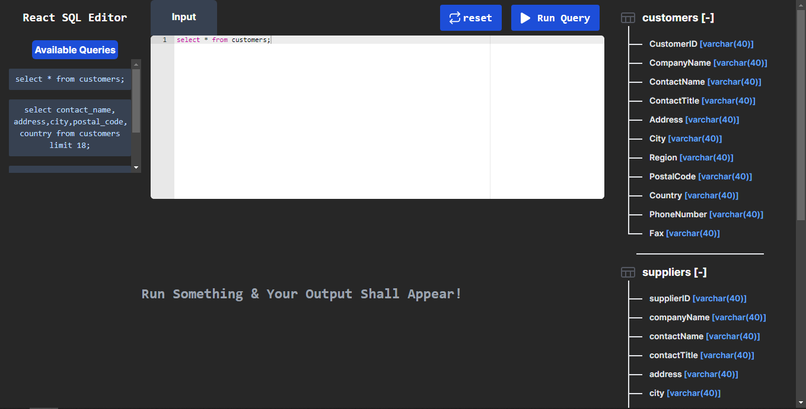
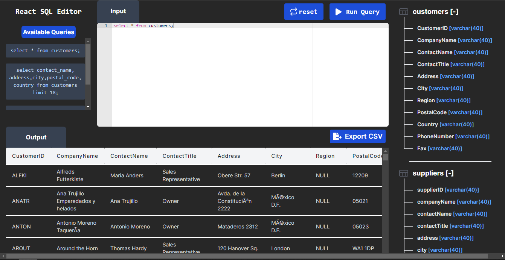
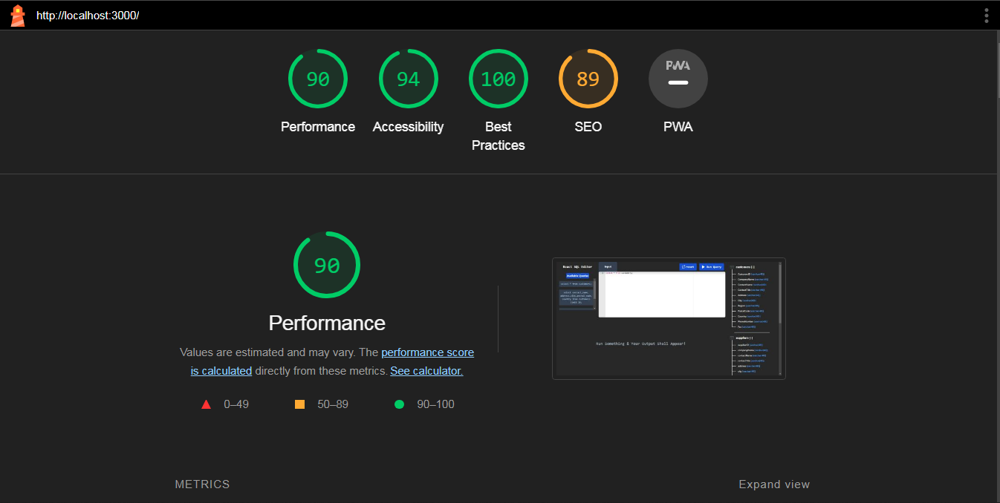
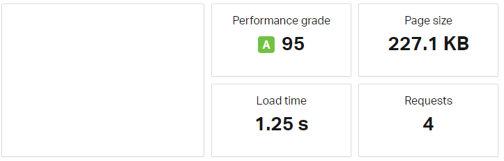

# Squiler

## Demo link:
Access my site at [squiler.vercel.app](https://squiler-bhanujatin.vercel.app/)

## Table of Content:

- [About The App](#about-the-app)
- [Screenshots](#screenshots)
- [Technologies](#technologies)
- [Dependencies](#dependencies)
- [Setup](#setup)
- [Approach](#performence)
- [Status](#status)
- [License](#license)

## About The App
Squiler is an app that is capable of running SQL queries and displaying the results of said query. it includes space which accepts SQL queries in the form of user inputs, then runs the given query, and displays the result within the application.

## Screenshots

## Technologies

## Dependencies
- **react-csv**
- **react-ace**
- **react-hot-toast**

## Setup
- download or clone the repository
- run `npm install`
- run `npm run dev`

## Performence

## load Time
I have calculated the page load time on `pingdom.com`
Got the load time **1.25 seconds**

Test [results](https://tools.pingdom.com/#6304608df4800000)

## Optimizations on performence
- Removed unused dependencies
- Create custom hook to fetch data asynchronously
- Use lightweight editor
- Minimise files

## Status
Squiler is still in progress. `Version 2` will be out soon.

## License

MIT license @ BHANUJATIN